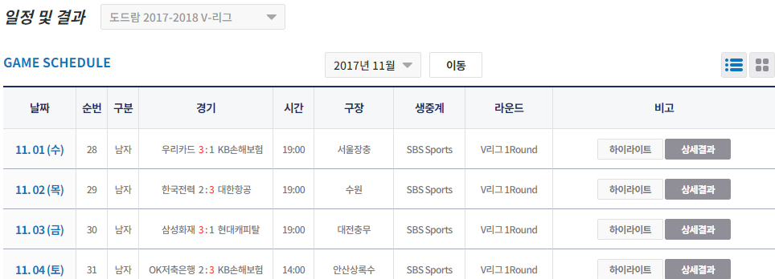
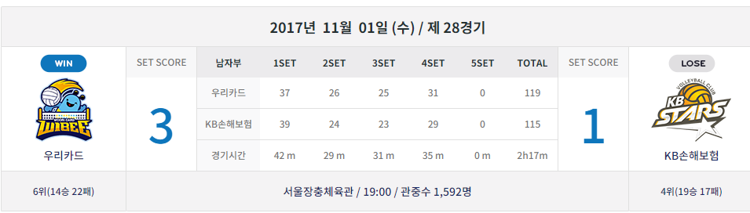
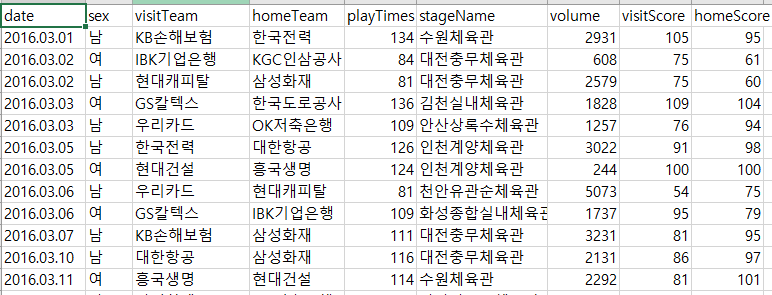
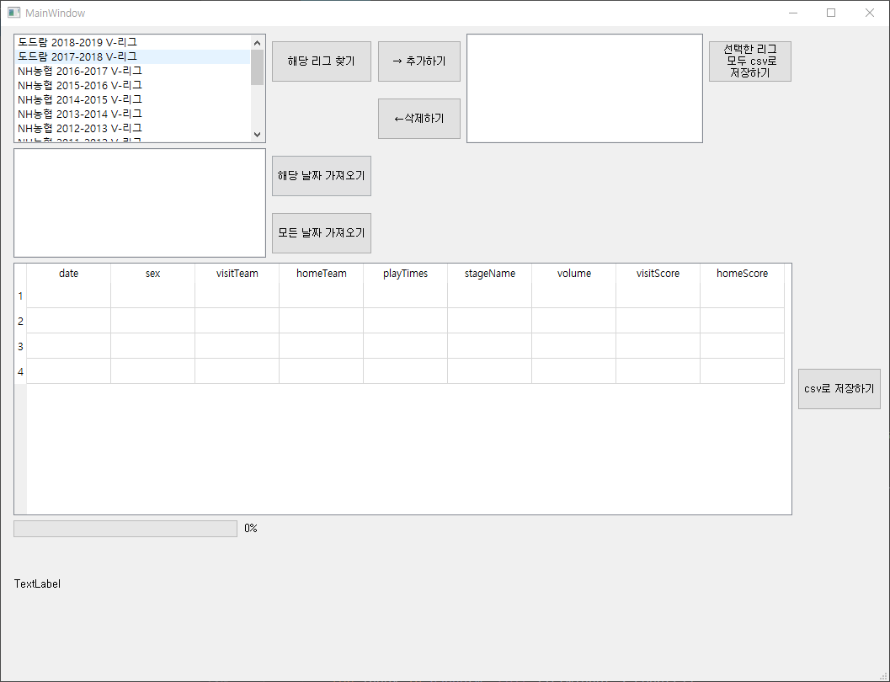

# 개요
한국 프로 배구(남/녀) 데이터를 GUI를 이용하여 csv파일로 저장하기. 

python - selenium 과 PyQt5 사용함.

https://www.kovo.co.kr/game/v-league/11110_schedule_list.asp?season=014&team=&s_part=1&yymm=2017-11

해당 사이트를 들어가면, 리그별로 월별 경기가 나온다.

해당 날짜의 상세결과를 통하여, 

상세정보들을 확인할 수 있다.

저는 년도-월-일, 원정팀, 홈팀, 경기장명, 관중수, 원정팀점수, 홈팀점수 를 갖고왔습니다.

해당 정보들을 csv파일로 저장합니다.

# 사용방법-1  
## 1개의 리그 데이터만 가져오기.

run.py를 실행하면 몇초 지나고 GUI창이 뜹니다.

(몇초 걸리는 이유는 해당 리그들을 가져오기 위함입니다.)

해당 리그를 선택하고 **해당 리그 찾기** 버튼을 클릭하면, 

몇초 지나고 밑에 해당 리그의 경기가 있던 **년도-월** 이 나타납니다.

해당 날짜를 선택하고 **해당 날짜 가져오기** 버튼을 클릭하면 

몇분 후 밑에 tableWidget에 데이터가 나타납니다. 

