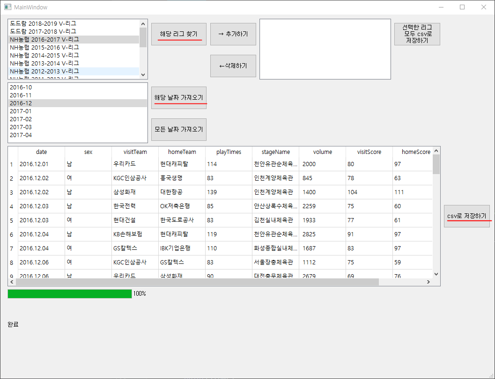

# 개요

한국 프로 배구(남/녀) 데이터를 GUI를 이용하여 csv파일로 저장하기. 

python - selenium 과 PyQt5 사용함.

https://www.kovo.co.kr/game/v-league/11110_schedule_list.asp?season=014&team=&s_part=1&yymm=2017-11

해당 사이트를 들어가면, 리그별로 월별 경기가 나온다.

해당 날짜의 상세결과를 통하여, 

상세정보들을 확인할 수 있다.

저는 년도-월-일, 원정팀, 홈팀, 경기장명, 관중수, 원정팀점수, 홈팀점수 를 갖고왔습니다.

해당 정보들을 csv파일로 저장합니다.

# 사용방법-1  
## 1개의 리그에서 해당 월의 데이터만 가져오기 및 csv 저장하기 

run.py를 실행하면 몇초 지나고 GUI창이 뜹니다.

(몇초 걸리는 이유는 해당 리그들을 가져오기 위함입니다.)

해당 리그를 선택하고 **해당 리그 찾기** 버튼을 클릭하면, 

몇초 지나고 밑에 해당 리그의 경기가 있던 **년도-월** 이 나타납니다.

해당 날짜를 선택하고 **해당 날짜 가져오기** 버튼을 클릭하면 

몇분 후 밑에 tableWidget에 데이터가 나타납니다. 
( 경기수의 따라 길면 4분정도 걸리는 것 같습니다. 

#### GUI가 응답 없음이 뜨는 경우가 많은데, python 실행창에는 계속해서 데이터를 받고 있으니, 기다려주시면 됩니다. ) 

그리고 **csv로 저장하기** 버튼을 클릭하면 
저장하고 싶은 경로에 이름을 적어주시면 해당 데이터를 .csv파일로 저장하게 됩니다. 

# 사용방법 -2 
## 1개의 리그 데이터의 모든 경기 가져오기 및 csv로 저장하기 

리그를 선택하고, **해당 리그 찾기** 버튼을 클릭하신 다음에,

**해당 날짜 가져오기** 버튼이 아닌, **모든 날짜 가져오기** 버튼을 누르시면 됩니다.

한달데이터를 가져오는게 2-4분 정도 걸리니, 평균 5개월 정도 경기를 하니, 길면 20분정도 걸립니다. 

마찬가지로 데이터가 tableWidget에 나타났다면, **csv로 저장하기** 버튼을 클릭해서 저장해주시면 됩니다.

# 사용방법 -3 
## 여러개의 리그 데이터 모든 경기 한번에 csv로 저장하기.

***이 방법은 데이터를 가져온 것을 tableWidget에 보여주지 않습니다***

**해당 리그 찾기** 버튼을 클릭하지 않고, 오른쪽에 **→ 추가하기** 버튼을 클릭합니다.

그러면 오른쪽 list에 원하는 리그만 추가하게 됩니다.

반대로 list에 삭제하고 싶은 리그는 **← 삭제하기** 버튼을 클릭하면 됩니다.

내가 원하는 리그들만 list에 차있다면, 

**선택한 리그 모두 csv로 저장하기** 버튼을 클릭하시면 됩니다.

저장할 폴더를 지정해주시면 됩니다.

데이터명은 **폴더/session_date.csv**입니다.

(session은 리그들을 구별해주는 key입니다. 물론 date를 보고 리그들을 구별할 수 있습니다.)

